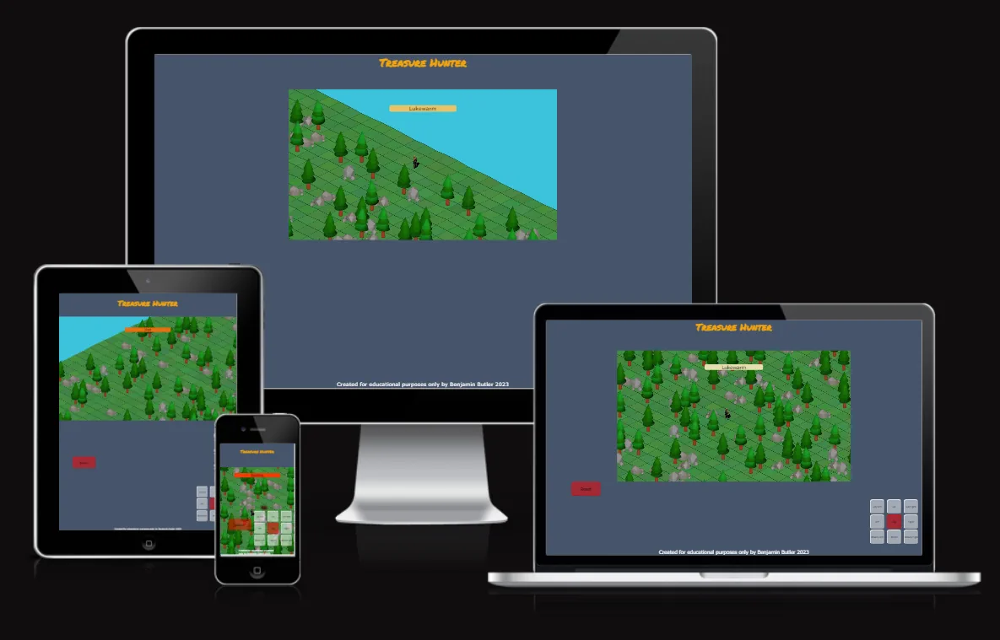
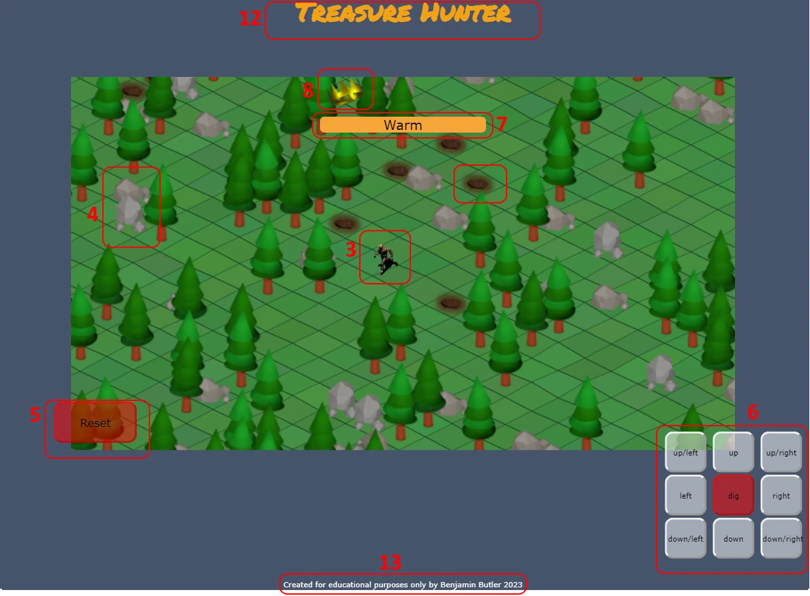
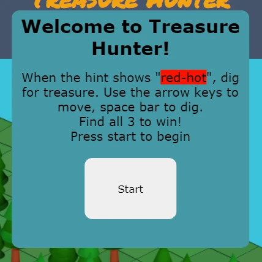
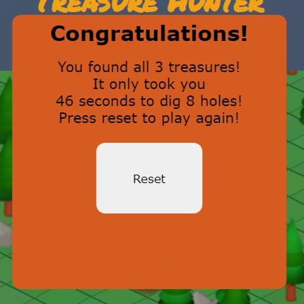
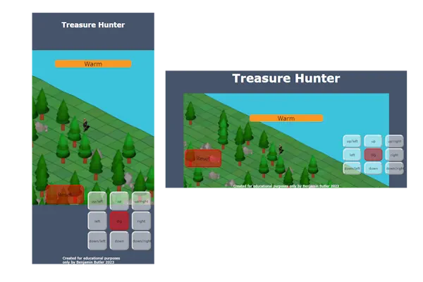
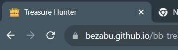
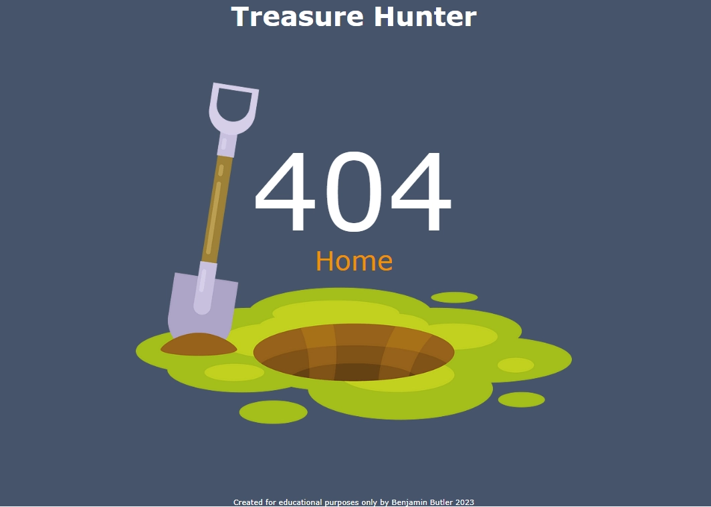

# Treasure Hunter

Treasure Hunter is a game in which the player must find three pieces of buried treasure on a small island. the game can be accessed [here](https://bezabu.github.io/bb-treasure-hunter/index.html).

# Features

## Existing Features

### Game Loop

The aim of the game is to find 3 hidden treasures. The player controls the hunter and can move them in 8 directions, and can dig at the hunter's current location to attempt to dig up treasure. Digging will make a hole in the ground so that the player knows not to try again in the same location.

### 1 Procedurally generated terrain

The game world, or map is randomly generated each time the game loads. Trees, rocks and buried treasure are dispersed around the map for the player to avoid or interact with. There are also subtle variations in the colour and elevation of the ground and there are 4 tree variants and 3 rock variants. During generation, each cell has a chance to spawn a tree or a rock (unless it is the player starting cell) and three cells are randomly selected for the treasure.
The terrain data is stored in several 2 dimensional arrays. Nested for loops are used to iterate through every element in the array whenever values are being assigned or read.

### 2 Isometric projection

To give the illusion of perspective, an isometric projection is used to display the terrain. X and Y coordinates or objects and terrain are passed through a function which converts them. This results in the diamond shaped cells common in computer games in the 1990s and 2000s. All features that are not the terrain (trees, rocks, the player) are sorted by their isometric y coordinate and drawn in order so that features closer to the 'camera' are drawn over features that appear further away. To prevent the player losing track of where they are whn obscured by trees, a 20% opacity overlay of the player sprite is shown regardless.

### 3 the Hunter

The hunter is the player avatar. The hunter can move in 8 directions and can dig in the currently occupied cell. The player can control the hunter using either the keyboard or by pressing buttons. The hunter has an idle animation and a moving animation for each direction. This has been achieved by using canvas to only draw a section of the image, changing the section depending on the direction the hunter is facing and wether or not they are moving.

### 4 collision detection

Whenever the player attempts to move, the destination is checked against the feature map for potential obstacles. If a rock is in the location the player is trying to move to, movement is prevented.

### 5 reset button

The reset button reloads the page so that in the event of an unfavourable map, for example the player or treasure hemmed in by impassable rocks, the player can try again. It does this by reloading the page.

### 6 movement buttons

One of the ways input is obtained from the player on smaller devices is through the movement buttons. They are styled so that they should not obscure the centre of the game area regardless of portrait or landscape orientation.

### 7 hint message

While the player is traversing the game world, a small hint message is displayed to aid the player in locating the treasure. A function determines the distance between the player and the nearest treasure and displays a hot/cold style hint. The hint message is also styled so that the background changes colour to make it more noticable. It is placed in a central location above the hunter so that the user should not have to look back and forth between two locations.

### 8 treasure indicator

The game keeps track of how many pieces have been found by the player and displays them above the hint message.

### 9 start modal

Before the player can begin, a short message appears explaining the presmise and controls. The user must press the start button to begin the game. This also starts the timer. The players movement is prevented while the modal is displayed.

### 10 win modal

When the player has located and dug up each of the three treasure goals, a message is shown on the screen congratulating the player and displaying the time taken. The player is then prompted to press the reset button to play again. The players movement is prevented while the modal is displayed.

### 11 responsive design

Particular care has been taken to ensure the buttons do not obscure too much of the game area on smaller devices in either portrait or landscape orientations. The game area also shrinks slightly to avoid the player avatar being cut off on smaller devices.

### 12 header

A simple header with the title of the game is shown at the top of the page. There are no navigational elements.

### 13 footer

A simple footer with a short sentance explaining the web site and game were created by me for educational purposes only. 

### 14 favicon

A custom favicon has been created to make the page stand out among other tabs.

### 15 custom 404 page

A custom 404 page has been made for the web site to enable the user to find their way back to the homepage if they become lost.

## Features to implement

### Pathfinding

I attempted to write a pathfinding algorithm that would plot a path between two points, but was unsuccessful.

### Customizable difficulty settings

Amount of treasure to find, amount of rocks or other obstacles. The nature of the game could be changed in a way so that finding treasure only adds time onto a timer which is constantly counting down to game over.

### Better terrain generation

Given more time, I would like to enhance the terrain generation so that it looks more natural and poses more of a challenge to the player. Trees could be grouped together more allowing for small clearings. More variation to the coasts, possibly even rivers extending into the island. Treasure prevented from spawning too close to other treasure.

### computer controlled antagonist

With pathfinding, it would be possible for another entity to hunt down the player, presenting more of a challenge and a fail state to the game.

# Technologies

- HTML has been used to structure the web site.
- CSS has been used to style the web site.
- javascript has been used to create the game including interactive elements
- [Blender](https://www.blender.org/) was used to create 3d models of trees, rocks, holes and crowns
- [Pain.NET](https://www.getpaint.net/) was used to edit images
- [GitHub](https://github.com/) has been used to store code, images and other contents.
- Gitpages was used to deploy the website.
- Git was used for version control, pushing contents to github.
- [Codeanywhere](https://app.codeanywhere.com/) was used as IDE.
- [favicon.io](https://favicon.io/) was used to make a simple favicon
- [Wave Web Accessibility Evaluation tool](https://wave.webaim.org/) was used to test the accessibility of the web site.
- [W3C Markup Validation Service](https://validator.w3.org/) was used to check HTML.
- [W3C CSS Validation Service](https://jigsaw.w3.org/css-validator/) was used to check CSS.
- [JSHint](https://jshint.com/) was used to test the javascript code
- [HTMLcolourcodes.com](https://htmlcolorcodes.com/) was used to get hex colour values.
- [Am I Responsive](https://ui.dev/amiresponsive?url=https://bezabu.github.io/bb-treasure-hunter/index.html) was used to create the mockup
- chrome developer tools was used for testing
- [Google fonts](https://fonts.google.com/specimen/Permanent+Marker/tester) has been used to import the font Permanent Marker.

# Testing

- Devices and browsers used in testing:
  - Laptop running Windows 10 Home
    - Chrome
    - Firefox
    - Edge
    - Opera
  - Laptop running Windows 8.1
    - Chrome
    - Firefox
    - Edge
  - Sumsung Galaxy S22
    - Chrome
    - Free Adblock Browser
    - Firefox
  - Samsung Galaxy Tab A (2016)
    - Chrome
    - Samsung Internet
    - Free Adblock browser
  - 

- When using Samsung Internet browser on a smart phone set to dark mode, the background colours of the page, modals, hint messages and buttons will be darker. Images and shapes do not seem to be affected
- Firefox handles touchscreen inputs differently which can affect moving in diagonal directions. Diagonal buttons mitigates this.

## General

- Check the responsiveness of the website on different screen sizes on different browsers

  - Test: Open the website in each browser and click inspect and resize the window slowly down to 300px and back up again, checking everything is displaying properly
    - Result: All elements display correctly in each size.

  - Test: Open the website in developer tools and simulate a phone screen in both portrait and landscape orientations. Check that the buttons do not obscure the player avatar.
    - Result: Reset and directional buttons begin to overlap at around 310px wide. The only device with a width less than 320 that I can find is the Galaxy Fold in folded configuration, but I have moved the reset button so that it only starts to overlap at screen widths of less than 300px.

- Check modals display correctly.

  - Test: Load the website and wait for the start modal to appear.
    - Result: It appears in front of the game area, as intended. The win modal is not visible.

  - Test: Click on the 'start' button to dismiss the start modal
    - Result: The start modal disappears and the game now accepts player input, as intended. The win modal is not visible.

  - Test: Complete the game and wait for the win modal to appear.
    - Result: The win modal is displayed correctly in front of the game area, as intended. No player input is accepted apart from the two reset buttons.

- Check the restart buttons work correctly

  - Test: Click on the reset button at the following scenarios: before starting the game (while the start modal is visible), after starting the game, after completing the game(win modal visible)
    - Result: The reset button functions correctly and reloads the page in all circumstances. The reset button in the win modal functions correctly.

- Check isometric projection works correctly
  - Test: Begin the game and observe the shape of the cells that make up the terrain.
    - Result: Cells are diamond shape, as intended
    - 
  - Test: Begin the game and move the hunter in all directions. Check that directions moved match the inputs
    - Result: The direction skew 45  to degrees has been accounted for, the hunter moves in the correct direction
  - Test: Begin the game and observe the terrain for variations in height.
    - Result: Subtle variations present and accounted for when drawing features and hunter.
  
- Check player movement inputs received correctly

  - Test: Begin the game on a PC and press every combination of the keyboard arrow keys, i.e. up, up and left, up and right, up and down, down, down and left and so on, and observe hunter movement.
    - Result: The hunter moves as expected; when two oposing directions (for example left and right) are pressed simultaneously, the hunter does not move (but does display a moving animation), when two non oposing direction (for example up and left) inputs are pressed they combine to move in a diagonal direction. 
    - When 3 direction inputs are pressed, the two oposing directions cancel out and the player moves in the unoposed direction(again with possible incorrect animation displayed), and when all 4 direction inputs are pressed, the hunter does not move(but does show a moving animation).
    - The hunter moves as intended in the correct direction with only one keyboard direction input.

  - Test: Begin the game on a touchscreen device and press every combination of the direction buttons, or as many as possible.
    - Result: For up/down/left/right buttons the hunter moves correctly always. There is no movement when pressing oposing directions, regardless of the direction (diagonal or otherwise), but an animation is displayed. When two oposite but not precisely oposing directions are pressed (for example up/left and down), the resulting movement will be non diagonal. 
    - In firefox, it interprets two simultaneous touch inputs as zooming in or out and interrupts button inputs (but strangely not while pressing 3 buttons simultaneously).
    - When 3 or more buttons are pressed, there will be no movement, regardless of the directions(except on firefox).
    - When a direction is pressed, and a second direction is pressed so that the hunter changes direction during a period where two buttons are pressed, when the first button is released, an idle animation is displayed even while the hunter moves.
    - When a button is pressed, if the cursor moves too far from the original point at which it was pressed, it will register as the cursor leaving the button area. This happens even though the cursor may not move all the way outside the button area. This is aleviated somewhat by disabling context menus and text selection on the buttons.

- Check dig input received correctly

  - Test: Begin the game and press the spacebar and press the dig button in an empty cell. Observe outcome.
    - Result: The cell is marked as previously dug and a hole appears. If it is a treasure location, it is displayed appropriately.

- Check collision detection works correctly

  - Test: Begin the game and move the hunter towards a rock. Attempt to run through it and observe. Do the same at the edges of the island.
    - Result: The hunter will not move through the cell containing the rock or past the edges of the island. A running animation is still displayer

- Check 'perspective' draw order is correct

  - Test: Begin the game and move the hunter behind a tree and a rock at various points, from each corner of the map and observe the hunter.
    - Result: The hunter is obscured by trees and rocks that are lower down (and therefore should be 'in front' of the hunter), and a faint overlay of the hunter is displayed in the correct position

- Check hint message is functioning correctly
  
  - Test: Begin the game and locate a piece of treasure using the hint message, checking against the console log which displays the locations of the 2 treasures, and observe the outcome.
    - Result: The hint message displays the text "red-hot" at the treasure location and at an acceptable radius around it (2-3 cells). 
  
  - Test: Begin the game, find 2 of the 3 treasures and move as far away from the remaining treasure as possible to verify the hint message is correct at long distances.
    - Result: Beyond a certain distance to the treasure, the hint message will display the text "Absolute zero" (about 28 cells).
  
- Check treasures found indicator is working correctly
  - Test: Begin the game, find and dig up a treasure. Observe the outcome.
    - Result: A crown image appears in the correct position after the first treasure is found. The second crown image appears after the second treasure is found. The third crown image appears after the third treasure is found. Due to the way in which elements are styled, it is only possible to see the third crown on smaller screen sizes, but by this point the win modal is visible to inform the player that they have found the third treasure.

- Check features and treasure locations are randomly generated
  - Test: Restart the game several times, observing the distribution of the trees, rocks and elevation, and check the treasure locations in the console log.
    - Result: The trees, rocks, elevation and treasure distribution are different every time.

- Check that the timer works correctly and the log of holes dug is correct
  - Test: Use a stopwatch to time how long a game takes and make a not of how many holes are dug over the course of the game. Compare to the win modal message.
    - Result: The timer and hole counter are accurate.

## Validator Testing

- No errors were returned when passing through the [W3C HTML Validator](https://validator.w3.org/nu/?doc=https%3A%2F%2Fbezabu.github.io%2Fbb-treasure-hunter%2Findex.html)
- No errors were returned when passing through the [W3C CSS Validator](https://jigsaw.w3.org/css-validator/validator?uri=https%3A%2F%2Fbezabu.github.io%2Fbb-treasure-hunter%2Findex.html&profile=css3svg&usermedium=all&warning=1&vextwarning=&lang=en)
- No errors were found when passing through the [JSHint Code Analysis Tool](https://jshint.com/)
- No errors or alerts were returned when passing through the [WAVE Web Accessibility Evaluation tool](https://wave.webaim.org/report#/https://bezabu.github.io/bb-treasure-hunter/index.html)

## Unfixed Bugs

- On touchscreen devices moving a finger enough distance while pressing a button will register as leaving the button (except in firefox).
- Hunter may have incorrect direction animation if certain unintuitive combinations of inputs are received, but still moves in the correct direction.

# Deployment

The site was deployed to GitHub pages. The steps to deploy are as follows:

- In the GitHub repository, navigate to the Settings tab
- From the source section drop-down menu, select the Master Branch
- Once the master branch has been selected, the page will be automatically refreshed with a detailed ribbon display to indicate the successful deployment.
- The live link can be found here: [https://bezabu.github.io/bb-treasure-hunter/](https://bezabu.github.io/bb-treasure-hunter/)

# Credits

## images

- Images used for trees, rocks, crowns and holes were made by me using Blender and Paint.NET

- The hunter sprite set was taken from [this tutorial](https://programmingmind.net/demo/isometric-game-development-in-html-5-canvas-part-1) and has been made [free for public use](https://flarerpg.org/) by the artist, [Clint Bellanger](https://clintbellanger.net/)

- The shovel and hole in the ground image used in the 404 page was taken from [creazilla](https://creazilla.com/nodes/7766525-hole-in-the-ground-clipart) and is "free for editorial, educational, commercial, and/or personal projects. No attribution required."

## code

- Instructions on how to convert to isometric coordinates were taken from [this tutorial](https://clintbellanger.net/articles/isometric_math/)
  
- Instructions on how to use canvas to animate sprites were taken from this [youtube tutorial](https://www.youtube.com/watch?v=GFO_txvwK_c)
  
- Insctructions on how to use canvas were taken from this [tutorial(part of developer documentation)](https://developer.mozilla.org/en-US/docs/Web/API/Canvas_API/Tutorial)

- Instructions on how to use 2 dimensional arrays were taken from [this stackoverflow thread](https://stackoverflow.com/questions/966225/how-can-i-create-a-two-dimensional-array-in-javascript)

## other